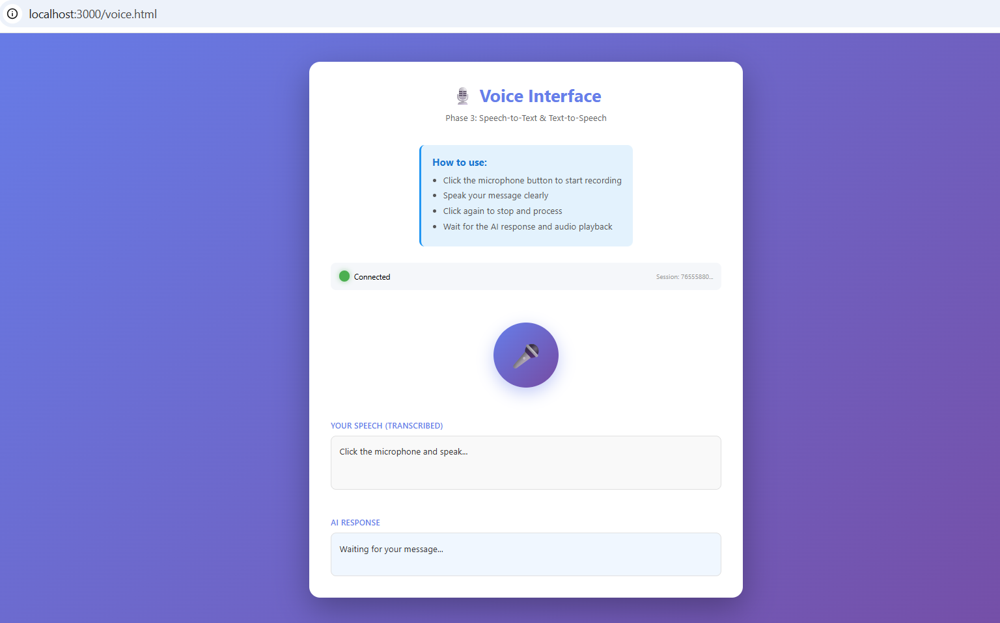
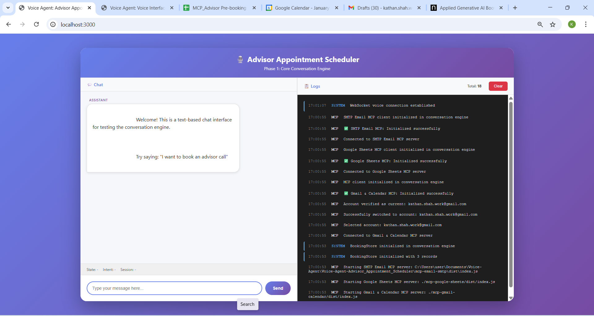
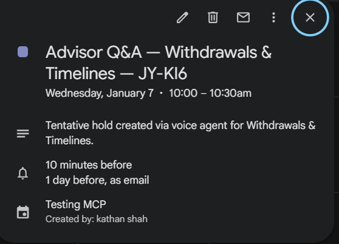
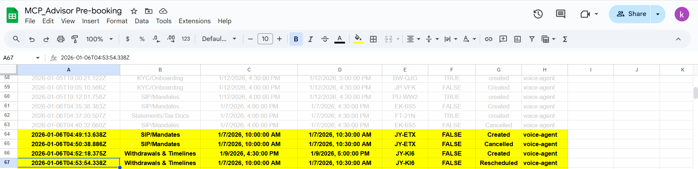
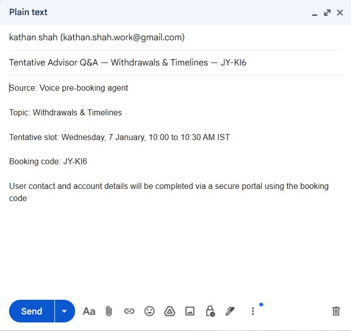

# Voice Agent: Advisor Appointment Scheduler


## Phase 1: Core Conversation Engine

A voice-based appointment scheduling system that allows users to book, reschedule, and cancel advisor consultations. Phase 1 implements the core conversation engine with text-based chat interface for testing.



## Features

- ✅ **5 Core Intents**: Book new, Reschedule, Cancel, "What to prepare", Check availability
- ✅ **Topic Taxonomy**: Maps user input to 5 fixed topics
- ✅ **Dialog State Machine**: Manages conversation flow and state
- ✅ **Mock Availability Service**: Returns available time slots (IST timezone)
- ✅ **Booking Code Generation**: Unique codes (e.g., NL-A742)
- ✅ **Guardrails**: PII detection and investment advice refusal
- ✅ **AI Integration**: Groq/Claude API for intent classification and slot extraction
- ✅ **Web Chat UI**: Simple text-based interface for testing

## Prerequisites

- Node.js 18+ (with ES modules support)
- npm or yarn
- API key for at least one AI provider:
  - Groq API key (recommended for fast inference)
  - Anthropic API key (Claude)
  - Gemini API key (optional)

## Installation

1. Clone the repository:
```bash
git clone <repository-url>
cd Voice-Agent-Advisor_Appointment_Scheduler
```

2. Install dependencies:
```bash
npm install
```

3. Set up environment variables:
```bash
# Copy .env.example to .env (if it exists) or create .env file
# Add your API keys:
GROQ_API_KEY=your_groq_api_key_here
# OR
ANTHROPIC_API_KEY=your_anthropic_api_key_here

# Set AI provider (groq or claude)
AI_PROVIDER=groq

# Optional: Customize brand name and secure URL
BRAND_NAME=Advisor Desk
SECURE_URL=https://advisors.example.com/complete
PORT=3000
```

## Running the Application

### Development Mode
```bash
npm run dev
```

### Production Mode
```bash
npm start
```

The server will start on `http://localhost:3000`

### Access the Chat UI
Open your browser and navigate to `http://localhost:3000`

## Testing

### Run All Tests
```bash
npm test
```

### Run Tests in Watch Mode
```bash
npm run test:watch
```

### Generate Coverage Report
```bash
npm run test:coverage
```

## Project Structure

```
.
├── src/
│   ├── config/
│   │   └── constants.js          # Application constants
│   ├── engine/
│   │   ├── conversationEngine.js # Main conversation engine
│   │   ├── dialogState.js        # Dialog state machine
│   │   └── __tests__/            # Engine tests
│   ├── services/
│   │   ├── aiService.js          # AI/LLM integration
│   │   ├── availabilityService.js # Mock availability service
│   │   └── __tests__/            # Service tests
│   ├── utils/
│   │   ├── bookingCode.js        # Booking code generation
│   │   ├── guardrails.js         # PII and investment advice detection
│   │   ├── topicMapper.js        # Topic taxonomy mapping
│   │   └── __tests__/            # Utility tests
│   └── server.js                 # Express server
├── public/
│   └── index.html                # Web chat UI
├── package.json
├── jest.config.js
└── README.md
```

## Usage Examples

### Book New Appointment
```
User: "I want to book an advisor call"
AI: [Greeting, disclaimer, PII warning]
AI: "How can the advisor help you?..."

User: "I need help with nominee changes"
AI: "You chose Account Changes/Nominee. Is that correct?"

User: "Yes"
AI: "Which day and time works best?..."

User: "Tomorrow afternoon"
AI: "I have two options:
     1. Tuesday, 14 January from 3:00 PM to 3:30 PM IST
     2. Tuesday, 14 January from 4:30 PM to 5:00 PM IST
     Which do you prefer, 1 or 2?"

User: "1"
AI: "Great. Confirming your tentative advisor slot..."

User: "Yes"
AI: "Your booking code is NL-A742..."
```

### Reschedule Appointment
```
User: "I want to reschedule my appointment"
AI: [Greeting, disclaimer]
AI: "To reschedule, I'll need your booking code..."

User: "NL-A742"
AI: "I found your booking. Which day and time would work better?"
```

### Cancel Appointment
```
User: "Cancel my appointment"
AI: [Greeting, disclaimer]
AI: "To cancel, I'll need your booking code..."

User: "NL-A742"
AI: "Your tentative advisor appointment with code NL-A742 is now cancelled."
```

## API Endpoints

### POST /api/chat
Send a message to the conversation engine.

**Request:**
```json
{
  "message": "I want to book an advisor call",
  "sessionId": "optional-session-id"
}
```

**Response:**
```json
{
  "sessionId": "generated-session-id",
  "response": "Welcome to Advisor Desk...",
  "state": "greeting",
  "intent": "book_new",
  "slots": {
    "topic": null,
    "preferred_day": null,
    "preferred_time_window": null
  },
  "toolCalls": []
}
```

### GET /health
Health check endpoint.

## Guardrails

### PII Detection
The system automatically detects and blocks:
- Phone numbers
- Email addresses
- Account numbers

If PII is detected, the system responds:
> "For your safety, please do not share phone numbers, email addresses, or account numbers on this call. Use the secure link with your booking code instead."

### Investment Advice Refusal
If the user asks for investment advice, the system responds:
> "I'm not allowed to provide investment advice or recommendations. For that, please speak to a registered investment advisor. Would you like to book an advisor slot instead?"

## Topics

The system supports 5 fixed topics:
1. **KYC/Onboarding**
2. **SIP/Mandates**
3. **Statements/Tax Docs**
4. **Withdrawals & Timelines**
5. **Account Changes/Nominee**

## Timezone

All times are in **IST (Indian Standard Time, Asia/Kolkata)**.

Working hours: Monday to Saturday, 10:00 AM to 6:00 PM IST
Slot duration: 30 minutes

## Booking Codes

Format: `[A-Z]{2}-[A-Z0-9]{3}` (e.g., `NL-A742`)

Codes are generated randomly and checked for uniqueness.

## MCP Integration (Gmail & Calendar)








The application now includes integration with the Gmail & Calendar MCP server for real calendar operations.

### Setup

1. **Install the MCP Server** (already done if you followed installation):
   - The MCP server is located in `mcp-gmail-calendar/`
   - It has been built and is ready to use

2. **Get OAuth2 Credentials**:
   - Go to [Google Cloud Console](https://console.cloud.google.com/)
   - Create a project or select existing one
   - Enable Gmail API and Google Calendar API
   - Create OAuth2 credentials (Desktop application type)
   - Download the JSON file

3. **Place Credentials**:
   - Save the credentials as `mcp-gmail-calendar/credentials.json`
   - Or set `GOOGLE_CREDENTIALS_PATH` environment variable

4. **Configure Environment Variables**:
   ```bash
   # Enable MCP integration
   ENABLE_MCP=true
   
   # Path to MCP server (optional, defaults to mcp-gmail-calendar/dist/index.js)
   MCP_GMAIL_CALENDAR_PATH=./mcp-gmail-calendar/dist/index.js
   
   # Path to OAuth2 credentials (optional, defaults to mcp-gmail-calendar/credentials.json)
   GOOGLE_CREDENTIALS_PATH=./mcp-gmail-calendar/credentials.json
   ```

5. **Authenticate**:
   - On first run, the MCP server will prompt for authentication
   - Visit the provided URL to complete OAuth2 flow
   - Tokens are stored in `mcp-gmail-calendar/tokens/`

### Features

When MCP is enabled (`ENABLE_MCP=true`), the following tools use real calendar operations:
- `event_create_tentative` - Creates tentative calendar events
- `event_update_time` - Updates/reschedules events
- `event_cancel` - Cancels events
- `calendar_get_availability` - Checks real calendar availability

If MCP is disabled, the system uses mock mode. If MCP is enabled but fails, the operation will fail (no fallback to mock).

### Troubleshooting MCP

- **Authentication Required**: Make sure you've completed OAuth2 authentication
- **Credentials Not Found**: Verify `GOOGLE_CREDENTIALS_PATH` points to valid OAuth2 credentials
- **Server Not Starting**: Check that `mcp-gmail-calendar/dist/index.js` exists and is built
- **Falling Back to Mock**: Check logs for MCP initialization errors

See `mcp-gmail-calendar/SETUP_NOTES.md` for detailed setup instructions.

## Next Steps (Phase 2)

Phase 2 will add:
- ✅ Real MCP integration (Google Calendar, Sheets, Gmail) - **COMPLETED**
- Replace mock availability with real calendar checking
- Integration testing with actual services

## Troubleshooting

### AI Provider Not Working
- Check that your API key is set in `.env`
- Verify `AI_PROVIDER` is set to `groq` or `claude`
- Check API key validity and rate limits

### Tests Failing
- Ensure all dependencies are installed: `npm install`
- Check Node.js version: `node --version` (should be 18+)

### Port Already in Use
- Change `PORT` in `.env` file
- Or kill the process using port 3000

## License

MIT

